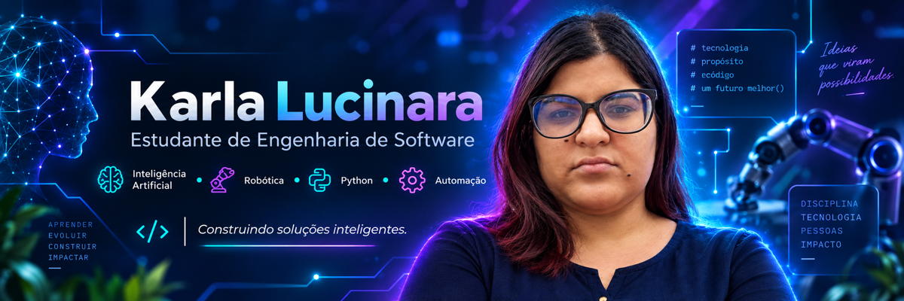

  

<h1 align="center">
  ✨ Karla Lucinara | Construindo o futuro com IA e Robótica 🤖
</h1>

  🎓 Estudante de Engenharia de Software focada em Inteligência Artificial, Robótica, Automação e Desenvolvimento de Software.

  
  
  
  

---

## 🤖 Sobre mim

🎓 Cursando **Engenharia de Software**

🧠 Tenho interesse em **Inteligência Artificial e Machine Learning**

🦾 Quero desenvolver conhecimentos em **Robótica e Automação**

💻 Estudo programação e desenvolvimento de software

🚀 Meu objetivo é criar projetos inteligentes que unam **Software, IA e Robótica**

---

## 🚀 Linguagens e Tecnologias

---

## 🧠 Áreas de interesse

---

## 📌 Meus projetos

### 📦 [Controle de Estoque](https://github.com/karla259/controle-de-estoque)

Sistema desenvolvido em **Python** para cadastro, entrada e saída de produtos.

---

### 🌐 [Portfólio Pessoal](https://github.com/karla259/portfolio-pessoal)

Projeto de portfólio para apresentar minha evolução, estudos e projetos na área de tecnologia.

---

### 💻 [Portfólio Engenharia de Software](https://github.com/karla259/portfolio-engenharia-software)

Projetos e atividades relacionados à minha formação em **Engenharia de Software**.

---

## 📚 Atualmente estudando

- 🐍 Python
- 🤖 Inteligência Artificial
- 🦾 Robótica
- 🧠 Machine Learning
- 💻 Engenharia de Software
- 🌐 HTML, CSS e JavaScript
- 🗄️ Banco de Dados
- 🔧 Git e GitHub

---

## 🎯 Meu objetivo

Quero me especializar em **Inteligência Artificial e Robótica**, desenvolvendo soluções que utilizem programação, automação e sistemas inteligentes.

---

## 🌐 Meu GitHub

---

## 📊 Estatísticas do GitHub

  
  

---

## 🔥 Atividade no GitHub

---

🤖 💜 <strong>Tecnologia • Inteligência Artificial • Robótica</strong> 💜 🤖

✨ Aprender • Evoluir • Criar • Impactar ✨

